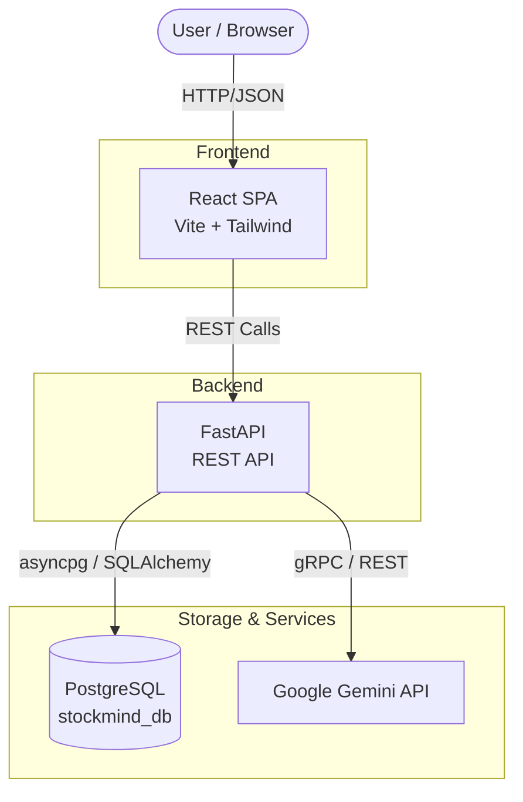

# StockMind 📦🤖

StockMind is a modern, AI-powered inventory and supply chain management platform designed for small-to-medium businesses. It bridges the gap between traditional warehouse ledgers and modern predictive analytics, ensuring you never run out of your best-selling products.

## 🏗️ Architecture

The application follows a standard modern web architecture without unnecessary complexity:


*(Note: Redis is completely unused by the application and has been removed from the environment configuration to simplify deployments).*

## ✨ Features

- **Full-Stack SaaS Architecture:** Built with React, FastAPI, and PostgreSQL. Features multi-tenant organization boundaries securely separating data.
- **Dynamic Dashboard:** Live metrics, low-stock alerts, and recent transaction monitoring.
- **Inventory Ledger:** Immutable transaction logs (`InventoryTransaction`) tracking every stock movement (`STOCK_IN`, `STOCK_OUT`, `SET`).
- **Purchase & Sales Orders:** Manage inbound stock from suppliers and outbound shipments to customers. Includes an interactive "Auto-Receive" PO simulator.
- **Gemini AI Assistant:** Connects directly to Google's Gemini LLM to analyze your catalog, identify low-stock risks, and autonomously draft multi-product Purchase Orders.

### 🤖 How the Gemini AI Assistant Works

The AI functionality in StockMind evaluates your live inventory and historical data to prevent stockouts:
* **Catalog & Inventory Analysis:** Gemini reads your entire product catalog (current stock, reorder points, sales volume) to understand your business health.
* **Low-Stock Risk Identification:** It identifies items that are approaching or below their reorder thresholds.
* **Purchase-Order Drafting:** It intelligently groups needed items by supplier, calculates optimal reorder quantities, and generates draft Purchase Orders.
* **User Review:** The AI does *not* automatically submit orders. All AI-generated drafts are presented for human review and approval before they are officially created in the system.

---

## 🚀 Getting Started

### Prerequisites
- Node.js (v20+)
- Python (3.10+)
- Docker and Docker Compose installed
- Git

### 1. Environment Setup

Before starting the application, you need to configure your environment variables.

Navigate to the `backend` directory and create your environment file:
```bash
cd backend
cp .env.example .env
```

**Important:** Open the newly created `backend/.env` file and configure:
- `GEMINI_API_KEY`: Provide a valid Google Gemini API key here for AI features.
- `SECRET_KEY`: Used for JWT authentication (can be any random string).
- `CORS_ORIGINS`: If running remotely (e.g. on AWS EC2), add your server's public IP address (e.g., `CORS_ORIGINS="http://<YOUR_EC2_IP>:5173,http://localhost:5173"`).

### 2. Choose Your Deployment Method

StockMind can be deployed in two different ways depending on the size of your server (e.g. AWS EC2).

- **10GB+ Storage (Recommended):** Use **Option A** (Full Docker). The total OS + Docker footprint will be around ~7.7 GB, leaving you a few gigabytes of breathing room.
- **8GB Storage (Free Tier Limit):** Use **Option B** (Hybrid). The full Docker build will crash with `no space left on device` on an 8GB drive due to temporary build cache spikes.

---

### Option A: Full Docker Deployment (Requires 10GB+ Storage)

This is the easiest method. It spins up the PostgreSQL database, FastAPI backend, and React frontend all at once inside Docker containers.

```bash
# From the root directory of the project:
# 1. Export your public IP for the frontend to use (use localhost if testing locally)
export VITE_API_URL="http://<YOUR_EC2_IP>:8000/api/v1"

# 2. Build and start all services
docker compose up --build -d
```
That's it! The services will be available at:
- **Web App (Frontend):** [http://<YOUR_EC2_IP>:5173](http://<YOUR_EC2_IP>:5173) 
- **FastAPI Documentation:** [http://<YOUR_EC2_IP>:8000/docs](http://<YOUR_EC2_IP>:8000/docs) 

---

### Option B: Hybrid Deployment (For 8GB/10GB Servers)

Because the Vite/React frontend requires significant disk space to build in Docker, you can run the database and backend in Docker, but run the frontend natively to save space.

**Step 1: Start ONLY the Backend & Database**
```bash
# From the root directory, specifying 'db' and 'backend' skips the frontend Docker build
docker compose up --build -d db backend
```

**Step 2: Install and start the Frontend Natively**
```bash
# Go into the frontend folder
cd frontend

# Install Node modules
npm install

# Export your public IP (use localhost if testing locally)
export VITE_API_URL="http://<YOUR_EC2_IP>:8000/api/v1"

# Run the frontend server natively
npm run dev -- --host 0.0.0.0
```
*(Tip: To keep the frontend running in the background on a server after you disconnect via SSH, use `nohup npm run dev -- --host 0.0.0.0 > my-frontend.log 2>&1 &`)*

### 5. Running Tests
To run the backend test suite, you can execute `pytest` directly inside your running backend container:
```bash
docker-compose exec backend pytest
```

---

## 📝 Recent Technical Updates & Database Changes

Over the course of the latest development iterations, the following major changes were implemented:

1. **Inventory "Exact Set" Logic (`backend/app/api/v1/endpoints/inventory.py`)**
   - **Change:** Expanded the `InventoryAdjustmentRequest` schema to include `new_quantity`.
   - **Reasoning:** Previously, the `adjust_inventory` endpoint only supported additive math (`quantity_changed`). It was updated to handle `transaction_type = 'SET'`, allowing the backend to calculate the delta (`new_quantity - current_stock`) and inject the exact adjustment required. This ensures the immutable ledger remains mathematically sound without requiring a schema migration.

2. **Purchase Order Deletion Logic (`backend/app/api/v1/endpoints/purchase_orders.py`)**
   - **Change:** Removed the `po.status == "Received"` block constraint.
   - **Reasoning:** Allows users to forcibly delete test POs that had already completed their delivery cycle to keep their testing workspaces clean. 

3. **React State Batching Fixes (`frontend/src/components/modals/*`)**
   - **Change:** Fixed closure traps inside `CreatePOModal.tsx` and `CreateSalesOrderModal.tsx`.
   - **Reasoning:** Previously, updating multiple fields of an array item (like `product_id` and `unit_price`) simultaneously using multiple `setItems([...items])` calls caused state overwrites. Logic was combined into a single batched state update.

4. **Default Warehouse Prioritization**
   - **Change:** Added hooks to dynamically prioritize selecting "Main Warehouse" across all dropdowns (Adjust Stock, PO Receive, Sales Orders) automatically reducing user click fatigue.

## 📄 License
This project is for demonstration and portfolio purposes.
